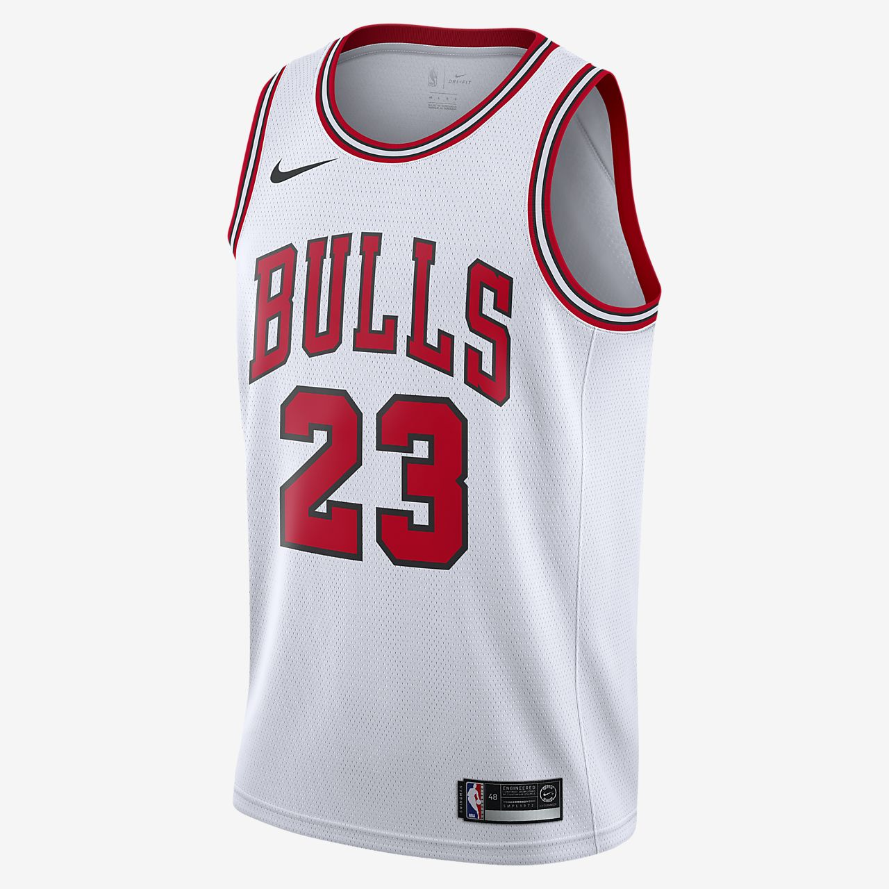

<center>

{width=400px}

</center>

```{r Setup, include=FALSE}
knitr::opts_chunk$set(warning = FALSE, message = FALSE, echo = FALSE, fig.align = 'center')
```


# Scenario and Aim of this Data Analysis

In the most recent NBA season (2018-19), the Chicago Bulls placed 27th out of 30 (a 22-60 win-loss record), 19 wins from the playoffs. As a result the Bulls secured the #7 pick in the NBA draft lottery. 

The Bulls budget for player contracts 2019-20 is $118 million.  
The Portland Trailblazers have the biggest budget for 2019-20 with $148 million.  
The team with the best league record in 2018-19, the Milwaukee Bucks have a budget of $131 million. ^[Hoops Hype][Hoops Hype](https://hoopshype.com/salaries/)

**So this report will aim to find the best five starting players (positional information available at ^[Wikipedia][Wikipedia](https://en.wikipedia.org/wiki/Basketball_positions)) the Bulls can afford. Ensuring we have enough budget leftover to have a full 12-man roster.**

The Positions being:   
Centre or 5  
Power Forward or 4  
Small Forward or 3  
Shooting Guard or 2  
Point Guard or 1  
 
## Load Required packages
```{r Packages, message=FALSE, echo = TRUE}
#Include all required packages at the start
library(tidyverse) 
library(ggplot2)
library(broom)
library(readxl)
library(stringi)
library(knitr)
library(kableExtra)
```


## Data Source
Statistics from the 2018-19 NBA season. The original source for each set is also listed below:

1. 2018-19_nba_player_statistics.csv :  sourced from ^[basketball-reference.com][basketball-reference.com](https://www.basketball-reference.com/leagues/NBA_2019_totals.html)
2. 2018-19_nba_player-salaries.csv :  sourced from ^[hoopshype.com/salaries][hoopshype.com/salaries](https://hoopshype.com/salaries/)
3. 2019-20_nba_team-payroll.csv : sourced from ^[hoopshype.com/salaries][hoopshype.com/salaries](https://hoopshype.com/salaries/)
4. 2018-19_nba_team-statistics_1.csv : sourced from ^[basketball-reference.com][basketball-reference.com](https://www.basketball-reference.com/leagues/NBA_2019.html)
5. 2018-19_nba_team-statistics_2.csv : sourced from ^[basketball-reference.com][basketball-reference.com](https://www.basketball-reference.com/leagues/NBA_2019.html)


### Read in Data
```{r Read in Data, message=FALSE, echo = TRUE, results='hide'} 
#read in the data sets from the working directory.
statistics <-read_csv("data/2018-19_nba_player_statistics.csv")
salary <-read_csv("data/2018-19_nba_player-salaries.csv")
payroll <-read_csv("data/2019-20_nba_team-payroll.csv")
team_statistics_1 <-read_csv("data/2018-19_nba_team_statistics_1.csv")
team_statistics_2 <-read_csv("data/2018-19_nba_team_statistics_2.csv")
```

### Check the Data
```{r Structure, message=TRUE, echo = TRUE, results='hide'}
str(payroll) #provides structure
head(payroll) #shows first 6 rows
tail(payroll) #shows last 6 rows

str(salary) #provides structure
head(salary) #shows first 6 rows
tail(salary) #shows last 6 rows

str(statistics) #provides structure
head(statistics) #shows first 6 rows
tail(statistics) #shows last 6 rows

str(team_statistics_1) #provides structure
head(team_statistics_1) #shows first 6 rows
tail(team_statistics_1) #shows last 6 rows

str(team_statistics_2) #provides structure
head(team_statistics_2) #shows first 6 rows
tail(team_statistics_2) #shows last 6 rows
```


```{r Na, message=FALSE, echo = TRUE, results='hide'}
#Check for missing values
sum(is.na(payroll)) 
sum(is.na(salary)) 
#Looking at the data frame there are 4 columns without data, there are 576 players.
576*4
#We should remove the spare columns
sum(is.na(statistics)) 
which(is.na(statistics))
naniar::vis_miss(statistics)
#Looking at the data frame there are players with na for % results (2p%, 3p%, FT%) where they have not attempted a shot.
#There is no reason to remove these na's as they present a non event.
sum(is.na(team_statistics_1)) 
which(is.na(team_statistics_1))
naniar::vis_miss(team_statistics_1)
#Looking at the data frame there are 3 columns without data.
#We should remove the spare columns
sum(is.na(team_statistics_2)) 
```

## Data Transformation
````{r Tidy Data, message=FALSE, echo = TRUE, results='hide'}
#Remove unwanted data.
salary <-salary[setdiff(colnames(salary), c('X4','X5', 'X6', 'X7'))]

team_statistics_1 <-team_statistics_1[setdiff(colnames(team_statistics_1), c('X23','X24', 'X25'))]

#We need to combine players that played for mutliple teams, using group_by "player_name" and summarise the columns that are numeric.
statistics <- statistics %>%
group_by(player_name, Pos) %>% 
summarise_each(funs(sum), 3:27)

#We should remove accents and periods from player names in the statistics data frame so it matches the salary data frame for later.
statistics$player_name <- statistics$player_name %>%
stringi::stri_trans_general("Latin-ASCII") %>%
stringr::str_replace_all(pattern = "\\.", replacement = "")

#Now we will also convert data that doesn't meet tidy data requirements (such as numbers at the start of variable names and %)
statistics <-rename(statistics,
                    FGp = `FG%`, 
                    x3P = `3P`, 
                    x3PA = `3PA`, 
                    x3Pp = `3P%`, 
                    x2P = `2P`, 
                    x2PA = `2PA`, 
                    x2Pp = `2P%`, 
                    eFGp = `eFG%`, 
                    FTp = `FT%`)

team_statistics_1 <-rename(team_statistics_1, 
                           TSp = `TS%`, 
                           eFGp = `eFG%`, 
                           TOVp = `TOV%`, 
                           ORBp = `ORB%`, 
                           FTpFGA = `FT/FGA`, 
                           DRBp = `DRB%`)

team_statistics_2 <-rename(team_statistics_2,
                           FGp = `FG%`, 
                           x3P = `3P`, 
                           x3PA = `3PA`, 
                           x3Pp = `3P%`, 
                           x2P = `2P`, 
                           x2PA = `2PA`, 
                           x2Pp = `2P%`,
                           FTp = `FT%`)
````

## Exploratory Analysis
**We want to generate more wins, our most obvious observations should start with team offensive and defensive prowess, so these are the statistical areas we will focus on:**

*ORtg: Offensive Rating; An estimate of points produced (players) or scored (teams) per 100 possessions  

*DRtg : Defensive Rating; An estimate of points allowed per 100 possessions  

*NRtg: Net Rating; an estimate of point differential per 100 possessions  

*TOVp: Turnover Percentage; An estimate of turnovers committed per 100 plays  


````{r Ratings and Wins}
ggplot(team_statistics_1, aes(x = ORtg, y = W))+ 
geom_point(alpha = 0.5, colour = "red")+
geom_smooth(method = "lm")

ggplot(team_statistics_1, aes(x = DRtg, y = W))+ 
geom_point(alpha = 0.5, colour = "red")+
geom_smooth(method = "lm")

ggplot(team_statistics_1, aes(x = NRtg, y = W))+ 
geom_point(alpha = 0.5, colour = "red")+ 
geom_smooth(method = "lm")

ggplot(team_statistics_1, aes(x = TOVp, y = W))+ 
geom_point(alpha = 0.5, colour = "red")+ 
geom_smooth(method = "lm")
````

**ORtg shows a positive correlation to wins, while DRtg and TOVp show a negative correlation. NRtg (Net Rating) an estimate of point differential per possessions shows what looks like the highest correlation.**

````{r Correlation}
#Checking the correlation between NRtg and Wins using the Perason method.
cor(x = team_statistics_1$NRtg, y = team_statistics_1$W, method = "pearson")
````


**Since both offensive (Offensive Rating) and defensive (Defensive Rating) measures play an important part in determining Net Rating and thus Wins we should look at a metric that measures most of these elements.** 

**The NBA provides ^[Efficiency][Efficiency](https://en.wikipedia.org/wiki/Efficiency_basketball), which is derived from basic individual statistics: points, rebounds, assists, steals, blocks and turnovers. The efficiency stat, in theory, accounts for both a player's positive offensive contributions (points, assists offensive rebounds) and defensive contributions (defensive rebounds steals, blocks), while putting a negative emphasis on turnovers (loss of possession).**

**So we should take a look at those statistics to see if we get a linear relationship.**
````{r Stats & Net Rating}
team_statistics<- merge(team_statistics_1,team_statistics_2, by  = "Team")

ggplot(team_statistics, aes(x = PTS, y = NRtg))+ 
geom_point(alpha = 0.5, colour = "red") + 
geom_smooth(method = "lm")

ggplot(team_statistics, aes(x = TRB, y = NRtg))+
geom_point(alpha = 0.5, colour = "red") + 
geom_smooth(method = "lm")

ggplot(team_statistics, aes(x = AST, y = NRtg))+
geom_point(alpha = 0.5, colour = "red") + 
geom_smooth(method = "lm")

ggplot(team_statistics, aes(x = STL, y = NRtg))+
geom_point(alpha = 0.5, colour = "red") + 
geom_smooth(method = "lm")

ggplot(team_statistics, aes(x = BLK, y = NRtg))+
geom_point(alpha = 0.5, colour = "red") + 
geom_smooth(method = "lm")

ggplot(team_statistics, aes(x = TOV, y = NRtg))+
geom_point(alpha = 0.5, colour = "red") + 
geom_smooth(method = "lm")
````


```{r Data Transformation}
team_statistics <- team_statistics %>%
  mutate(PTS_per_game = PTS / G,
         REB_per_game = TRB / G,
         AST_per_game = AST / G, 
         STL_per_game = STL / G,
         BLK_per_game = BLK / G,
         TOV_per_game = TOV / G)
````


````{r Mutliple Linear Regression}
#Creating our linear model using lm.
fit <- lm(NRtg ~ PTS_per_game + REB_per_game + AST_per_game + STL_per_game + BLK_per_game + TOV_per_game, data = team_statistics)
tidy(fit, conf.int = TRUE)
````

**Our slope coefficient says that teams that get 1 more:  **
**PTS_per_game than the average team, score 0.34 more NRtg_per_game than the average team  **  
**REB_per_game than the average team, score 0.78 more NRtg_per_game than the average team  **  
**AST_per_game than the average team, score 0.37 more NRtg_per_game than the average team  **  
**STL_per_game than the average team, score 0.69 more NRtg_per_game than the average team  **  
**BLK_per_game than the average team, score 1.53 more NRtg_per_game than the average team  **  
**TOV_per_game than the average team, score 2.02 less NRtg_per_game than the average team**  

### Predicted Values
**Our model looks like:** 

**$Net Rating = -66.19 + PTSpg + REBpg + ASTpg + STLpg + BLKpg -TOVpg$**

## Assumptions
### 1. The response variable should be continuous (i.e. ratio/interval)
**NRtg (Net Rating) is a measure of an estimate of point differential per 100 possessions, so is ratio scale of measurement.**

### 2. There are two or more explanatory variables that are either continuous of categorical
**Each of our explanatory variables are continuous.**

### 3. Independence of Observations
**There should be independence of observations.**
```` {r Independence of Observations}
#Using the car package we can check for independoence of observations.
car::durbinWatsonTest(fit)
````
**The Durbin-Watson statistic for the model show: a value of 1.24, indicating that there is no correlation between the residuals and that we have independence of observations.**

### 4. Linearity
**There should be a linear relationship between the response variable (NRtg) and each explanatory variable.**
````{r Partial Regression Plots}
#use the car package to check for linear relationships by creating partial regression plots, accounting for the effect of the other explanatory variables and the respone against each explanatory variable.
car::avPlots(fit)
````

**We can see there is a linear relationship between the NRtg and each of our explanatory variable. STL_per_game is weak however.**

### 5. Outliers, Influential or High Leverage Points
**Outliers, Influential and/or high leverage points have the ability to influence our model, so there is a need to identify any and potentially remove them from the data.**
````{r Outliers}
#Check the data for outliers.
std_res <- rstandard(fit)
points <- 1:length(std_res)

ggplot(data = NULL, aes(x = points, y = std_res)) +
geom_point(colour = "black") +
ylim(c(-4, 4)) +
geom_hline(yintercept = c(-3, 3), colour = "black", linetype = "dashed")+
theme(panel.background = element_rect(fill = 'red'))
````

**There looks to be no outliers, beyond 3 standard deviations from 0, in fact all points are within 2 standard deviations from 0.**

````{r Leverage Points}
#Check to see if any of the potential outliers create leverage, using hatvalues.
hats <- hatvalues(fit)
hats_labels <- if_else(hats >= 0.4, paste(points), "")

ggplot(data = NULL, aes(x = points, y = hats)) +
geom_point(colour = "black") +
theme(panel.background = element_rect(fill = 'red'))+
geom_text(aes(label = hats_labels), nudge_x =1)
````

**There do not appear to be any leverage points as all hatvalues are closer to 0 than 1, although there are three points (6, 11, & 21) in particular that are above 0.4 that we should look at potentially investigating.**

````{r Cooks Distance}
#Check for influence on the linear regression by potential outliers.
cook <-cooks.distance(fit)
cook_labels <- if_else(cook >= 0.2, paste(points), "")

ggplot(data = NULL, aes(x =points, y = cook)) +
geom_point(colour = "black")+
theme(panel.background = element_rect(fill = 'red'))+
geom_text(aes(label = cook_labels), nudge_x =1)
````

**It does not appear that points 11 or 20 are showing any influence or leverage in this instance, but this is the second time that point 11 has shown up in our checks for validity.**

````{r Cooks Distance2_PTS}
#We will double check each of the explanaotry variables against points 11 and 20 to see if we have any high leverage nad high influence.
ggplot(team_statistics, aes(x = PTS_per_game, y = NRtg))+
geom_point(alpha = 1, colour = "blue")+
geom_hline(yintercept = 0, colour = "red", linetype = "dashed")+
geom_smooth(method = "lm", colour = "blue")+
theme_gray()+
geom_text(aes(label = cook_labels), nudge_y = 0.5)
````

````{r Cooks Distance2_REB}
ggplot(team_statistics, aes(x = REB_per_game, y = NRtg))+
geom_point(alpha = 1, colour = "blue")+
geom_hline(yintercept = 0, colour = "red", linetype = "dashed")+
geom_smooth(method = "lm", colour = "blue")+
theme_gray()+
geom_text(aes(label = cook_labels), nudge_y = 0.5)
````

````{r Cooks Distance2_AST}
ggplot(team_statistics, aes(x = AST_per_game, y = NRtg))+
geom_point(alpha = 1, colour = "blue")+
geom_hline(yintercept = 0, colour = "red", linetype = "dashed")+
geom_smooth(method = "lm", colour = "blue")+
theme_gray()+
geom_text(aes(label = cook_labels), nudge_y = 0.5)
````

````{r Cooks Distance2_STL}
ggplot(team_statistics, aes(x = STL_per_game, y = NRtg))+
geom_point(alpha = 1, colour = "blue")+
geom_hline(yintercept = 0, colour = "red", linetype = "dashed")+
geom_smooth(method = "lm", colour = "blue")+
theme_gray()+
geom_text(aes(label = cook_labels), nudge_y = 0.5)
````

````{r Cooks Distance2_BLK}
ggplot(team_statistics, aes(x = BLK_per_game, y = NRtg))+
geom_point(alpha = 1, colour = "blue")+
geom_hline(yintercept = 0, colour = "red", linetype = "dashed")+
geom_smooth(method = "lm", colour = "blue")+
theme_gray()+
geom_text(aes(label = cook_labels), nudge_y = 0.5)
````

````{r Cooks Distance2_TOV}
ggplot(team_statistics, aes(x = TOV_per_game, y = NRtg))+
geom_point(alpha = 1, colour = "blue")+
geom_hline(yintercept = 0, colour = "red", linetype = "dashed")+
geom_smooth(method = "lm", colour = "blue")+
theme_gray()+
geom_text(aes(label = cook_labels), nudge_y = 0.5)
````

**Neither point 11 or 20 show high leverage or high influence.**

### 6. Homoscedasticity
**The data needs to show homoscedasticity.**
````{r Homoscedasticity}
#Plotting of the residuals against the fitted values.
res<- residuals(fit)
fitted <- predict(fit)


ggplot(team_statistics, aes(x = fitted, y = res))+
geom_point(colour = "black")+
geom_hline(yintercept = 0, colour = "black", linetype = "dashed")+
theme(panel.background = element_rect(fill = 'red'))+
geom_smooth(se = FALSE, colour = "white")

````

**This randomisation of the data shows homoscedasticity (constant variance), and as such we can be sure there appears to be no evidence of heteroscedasticity.**

### 7. Normality
**The residuals should be normally distributed.**
````{r Normality}
#Is there a normal distribution, check via a hitogram.

ggplot(data =NULL, aes(x= res))+
geom_histogram( colour = "red", fill = "black", binwidth = 1.5)+
theme(panel.background = element_rect(fill = 'red'))
````

**The data points appear normally distributed, although there is a larger tail.**

````{r Q-Q Plot}
#We can also check by using a nromal Q-Q plot.
ggplot(data = NULL, aes(sample =res))+
theme(panel.background = element_rect(fill = 'red'))+
stat_qq() + stat_qq_line()

````

**The Q-Q plot shows that the points appear normally distributed.**

### 8. Multicollinearity
**There should be no multicollinearity between the explanatory variables.**
````{r Pairs}
#We can check visually by using th pairs plot.
pairs(formula = ~ PTS_per_game + REB_per_game + AST_per_game + STL_per_game + BLK_per_game + TOV_per_game, data = team_statistics)
````

**There appears to be no evidence of a linear relationship between any of our explanatory variables.**

```` {r Variance Inflation Factor}
#Using the car packacge we can also check for multicollinearity.
car::vif(fit)

sqrt(car::vif(fit))
````

**The square root of the VIF shows how much greater the standard error in the relevant slope coefficient is, compared to if there was no relationship between predictors. e.g. PTS_per_game is 1.43 times larger than if there was a 0 correlation with the other explanatory variables.**

**This shows that there is no Multicollinearity.**

## Model Testing
**Our model that we are using is:**

**$Net Rating = -85.5 + PTSpg + REBpg + ASTpg + STLpg + BLKpg - TOVpg$**

### Applying the Model (Expected_NRtg v NRtg (2018-19))
````{r Applying the Model}
# Transform the data to create our Expected Net Rating (exp_NRtg_Per_game)
team_statistics<- mutate(team_statistics, exp_NRtg_per_game = predict(fit, newdata = team_statistics))

ggplot(team_statistics, aes(exp_NRtg_per_game, NRtg, label = Team)) + 
geom_point(colour = "black") +
geom_text(nudge_x = -1.25, cex = 2) +
theme(panel.background = element_rect(fill = 'red'))+
geom_abline(linetype = "solid", colour = "white") #Reference Line for 100% Prediction
````

### Applying the Model (Expected_NRtg v Wins (2018-19))
````{r Wins from NRtg}
ggplot(team_statistics, aes(x = W, y = exp_NRtg_per_game, label = Team)) + 
geom_point(colour = "black") +
geom_text(nudge_x = 3.5, cex = 2) +
theme(panel.background = element_rect(fill = 'red'))+
geom_abline(linetype = "dashed", colour = "blue")
````

## Player Metrics
**We can calculate the number of minutes each team played per game on average across the league. Normally this would be 5 * 48 = 240 minutes, however there are games that go into overtime.**
```{r Team Minutes Summary}
#Summarise MP for each team and divide by number of games.
min_per_game <- team_statistics %>%
group_by(Team) %>%
summarise(min_per_game = (MP/G)) %>%
pull(min_per_game) %>%
mean 

min_per_game
````

### Adjusting Players Expected Performance Per Minutes Played
**Next we can create new statistics per game for each player, adjusted for average minutes played per game.**

````{r Per Minute Performance}
#Transofrming the indidivual player statistics into a new data frame, with averages per game.
players <- statistics %>%
group_by(player_name) %>%
summarise(G = sum(MP) / min_per_game,
          PTS_per_game = sum(PTS) / G,
          REB_per_game = sum(TRB) / G,
          AST_per_game = sum(AST) / G, 
          STL_per_game = sum(STL) / G,
          BLK_per_game = sum(BLK) / G,
          TOV_per_game = sum(TOV) / G,
MP = sum(MP)) %>%
filter(MP >= 200) %>%
select(-G)
```` 

### Expected Net Rating Per Player
**The exp_NRtg metric can be interpreted as the net effect a player has on the overall score between their team and the opposition's team if all players are exactly like that player.**

````{r Expected NRtg Per Player}
#Creating our Expected NRtg
players <- mutate(players, exp_NRtg = predict(fit, newdata = players))
````

````{r Expected NRtg Per Player ggplot}
players %>%
ggplot(aes(x = exp_NRtg)) +
geom_histogram(binwidth = 0.5, colour = "red", fill = "black")+
theme(panel.background = element_rect(fill = 'black'))
````

### Adding Salary & Position
**We need to add the players salary and positions back into our source to complete our analysis.**
```` {r Salary & Position}
#We need to combine our tatistical data fram with the salary fata frame and put the players positions back into the data frame.
players <- salary %>%
select(player_name, salary) %>% 
right_join(players, by = "player_name")

players <- statistics %>%
select(player_name, Pos) %>% 
right_join(players, by = "player_name")
````

### Selecting Players by Expected NRtg
**Let's see who the best NRtg players are?**
````{r Expected NRtg}
players %>%
select(player_name, Pos, salary, exp_NRtg) %>% 
arrange(desc(exp_NRtg), salary) %>%
top_n(20)
````

````{r Expected NRtg ggplot}
players %>%
ggplot(aes(x = salary/1000000, y = exp_NRtg, color = Pos))+
geom_point()+ 
xlab("Salary (Millions)")+
theme(legend.position = "bottom")
````


## Players to Target
**We need to come up with our targets, o we will look at the positions**


### Centre
**Centre is traditionally a position where the main asset offensively is scoring. A secondary asset is rebounds (offensive) and limiting turnovers. While defensively, rebounds (defensive) and blocks are a good measure of defensive worth.**
````{r Expected NRtg ggplot Centre}
players %>%
filter(Pos == 'C-PF' | Pos == 'PF-C'| Pos == 'C') %>%
ggplot(aes(x = salary/1000000, y = exp_NRtg, color = player_name)) +
geom_point() + 
geom_text(aes(label=ifelse(exp_NRtg > 40,as.character(player_name),'')),hjust=1.2,vjust=0.5) +
expand_limits(x = -10)+
theme(legend.position = "none")+
xlab("Salary (Millions)") 
````

**Anthony Davis & Hassan Whiteside are the two best centres, however Mitchell Robinson shows tremendous value for money and this is who we should target. Robert Williams would be a good signing for our bench.**


### Power Forward
**Power Forward, similar to our centre is traditionally a position where the main asset offensively is scoring. A secondary asset is rebounds (offensive) and limiting turnovers. While defensively, rebounds (defensive) and blocks are a good measure of defensive worth.**
````{r Expected NRtg ggplot Power Forward}
players %>%
filter(Pos == 'C-PF' | Pos == 'PF-C' | Pos == 'PF' | Pos == 'PF-SF' | Pos == "SG-PF") %>%
ggplot(aes(x = salary/1000000, y = exp_NRtg, color = player_name)) +
geom_point() + 
geom_text(aes(label=ifelse(exp_NRtg > 30,as.character(player_name),'')),hjust=-0.05,vjust=0.5) +
expand_limits(x = 35)+
theme(legend.position = "none")+
xlab("Salary (Millions)") 
````

**Giannis Antetokounmpo is the best power forward in the league, his expected Net Rating is almost 50% better than the next best player, for $24million dollars, this may be worth the money, although Christian Wood and Cheick Diallo look like bargains and we should try and sign one or both of these players to help fill the rest of our roster.**


### Small Forward (Point Forward)
**Small Forward, is traditionally a position where the main asset offensively is scoring. A secondary assets is passing (assists) and limiting turnovers. While defensively, rebounds and steals are a good measure of defensive worth.**
````{r Expected NRtg ggplot Small Forward}
players %>%
filter(Pos == 'PF-SF' | Pos == 'SF' | Pos == 'SF-SG' | Pos == "SG-SF") %>%
ggplot(aes(x = salary/1000000, y = exp_NRtg, color = player_name)) +
geom_point() + 
geom_text(aes(label=ifelse(exp_NRtg > 10,as.character(player_name),'')),hjust=1.1,vjust=0.5) +
theme(legend.position = "none")+
expand_limits(x = -10)+
xlab("Salary (Millions)") 
````

**There is not many players at a value price here. Kawhi Leonard is the standout and should be our target. While Rondae Hollis-Jefferson, should be a target for our bench.**


### Shooting Guard
**Like Small Forward, shooting guard is traditionally a position where the main asset offensively is scoring. A secondary assets is passing (assists) and limiting turnovers. While defensively, rebounds and steals are a good measure of defensive worth.**
````{r Expected NRtg ggplot Shooting Guard}
players %>%
filter(Pos == 'SG' | Pos == 'SG-SF' | Pos == 'PF-SG' | Pos == 'SG-SF') %>%
ggplot(aes(x = salary/1000000, y = exp_NRtg, color = player_name)) +
geom_point() + 
geom_text(aes(label=ifelse(exp_NRtg > 4,as.character(player_name),'')),hjust=-0.2,vjust=0.5) +
expand_limits(x = 30)+
  theme(legend.position = "none")+
xlab("Salary (Millions)") 
````

**Jeremy Lamb should be our target here. While Pat Connaughton and Luka Doncic would be good targets to fill the bench.**


### Point Guard
**Point Guard is traditionally a position played by a ball handler. The main asset offensively being scoring and passing (assists) and limiting turnovers. Defensively steals are a good measure of defensive worth.**
````{r Expected NRtg ggplot Point Guard}
players %>%
filter(Pos == 'PG') %>%
ggplot(aes(x = salary/1000000, y = exp_NRtg, color = player_name)) +
geom_point() + 
geom_text(aes(label=ifelse(exp_NRtg > 5,as.character(player_name),'')),hjust=0,vjust=-1) +
expand_limits(x = 45, y = 75)+
theme(legend.position = "none")+
xlab("Salary (Millions)") 
````

**Michael Carter Williams should be our target here. Ben Simmons would be a good signing to fill our bench roster.**


# Chicago Bulls 2019-20

```{r Our Team}
#Creating a neew data frame with our 5 targets.
starting_5 <- players %>%
filter(player_name %in% c("Mitchell Robinson", "Giannis Antetokounmpo", "Kawhi Leonard", "Jeremy Lamb", "Michael Carter-Williams")) %>%
arrange(desc(salary))

View(starting_5)

#visualising our targets in both a grpah and a table.
starting_5 %>%
ggplot(aes(x = salary/1000000, y = exp_NRtg, label = player_name)) +
geom_point(colour = "black") +
geom_text(nudge_x = 7, cex = 5) +
theme(panel.background = element_rect(fill = 'red'))+
expand_limits(x = 40)+
theme(legend.position = "none")+
xlab("Salary (Millions)") 

sum(starting_5$salary)

kable(starting_5[1:5, 1:3]) %>%
  kable_styling("striped", full_width = F)%>%
  column_spec(1, bold = T)%>%
  row_spec(1:5, bold = T, color = "white", background = "#D7261E")
````

**Our starting team would cost $57,224,892. Leaving us approximately $60 million to secure the rest of the roster. **

**As a starting point, for the rest of the roster I would suggest Christian Wood as a backup Power Forward, he looks to be the most underpaid player in the league for his expected Net Rating. In addition to this if Robert Williams (C) can be signed for his salary that would give us 7 players for our roster for approximately $62 million, leaving us $56 million to fill the last 5 places.**

**As mentioned in the positional analysis there are other players we should look to target, just outside this list of starters.**

<center>

{width=400px}

</center>


## References

